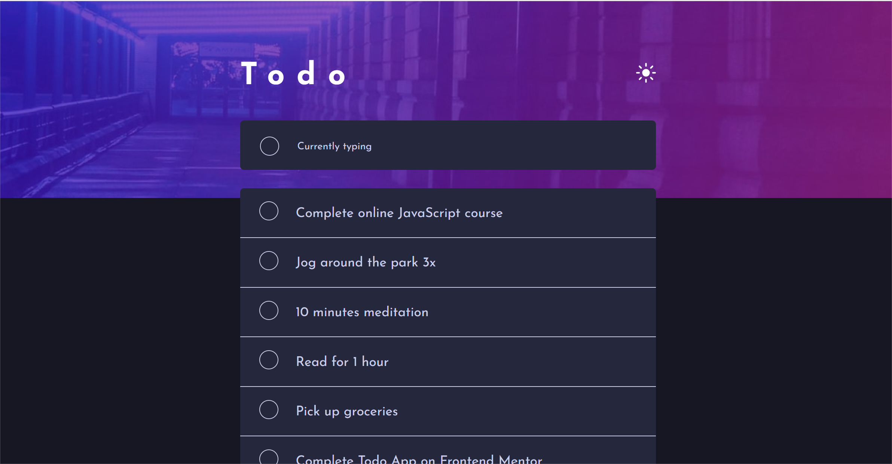

# Frontend Mentor - Todo app solution

This is a solution to the [Todo app challenge on Frontend Mentor](https://www.frontendmentor.io/challenges/todo-app-Su1_KokOW). Frontend Mentor challenges help you improve your coding skills by building realistic projects.

## Table of contents

- [Overview](#overview)
  - [The challenge](#the-challenge)
  - [Screenshot](#screenshot)
  - [Links](#links)
- [My process](#my-process)
  - [Built with](#built-with)
  - [What I learned](#what-i-learned)
  - [Continued development](#continued-development)
  - [Useful resources](#useful-resources)
- [Author](#author)
- [Acknowledgments](#acknowledgments)

## Overview

### The challenge

Users should be able to:

- View the optimal layout for the app depending on their device's screen size
- See hover states for all interactive elements on the page
- Add new todos to the list
- Mark todos as complete
- Delete todos from the list
- Filter by all/active/complete todos
- Clear all completed todos
- Toggle light and dark mode
- **Bonus**: Drag and drop to reorder items on the list

### Screenshot

### Links

- Solution URL: [https://github.com/Olamiposi-cloud-coder/todo-app.git]
- Live Site URL: https://olamiposi-cloud-coder.github.io/todo-app/

## My process

### Built with

- HTML5
- CSS custom properties
- Flexbox
- JavaScript

### What I learned

- Implementation of drag and drop functionality
- Usage of event listeners to handle user interactions
- Dynamic filtering of todo items based on their completion status

### Continued development

I plan to continue improving my skills in JavaScript, particularly in handling more complex user interactions and integrating third-party libraries for enhanced functionality.

### Useful resources

- [MDN Web Docs](https://developer.mozilla.org/en-US/docs/Web) - Comprehensive documentation on HTML, CSS, and JavaScript
- [Frontend Mentor](https://www.frontendmentor.io) - Great platform for practicing front-end development skills with real-world projects

## Author

- GitHub - [@Olamiposi-cloud-coder](https://github.com/Olamiposi-cloud-coder)
- Frontend Mentor - [@CLOUD-CODES](https://www.frontendmentor.io/profile/Olamiposi-cloud-coder)

## Acknowledgments

I'd like to thank the team at Frontend Mentor for providing this challenging project, as well as the community for their support and feedback.
